# COM3504 The Intelligent Web (SPRING 2018~19)

This project, **Gigg** is my submission for the COM3504 The Intelligent Web (SPRING 2018~19) assignment. The application is an installable [Progressive Web App](https://developers.google.com/web/progressive-web-apps/) built with MongoDB, Angular 8, ExpressJS and NodeJS. It is also functional offline. 

The only third party libraries used are: 
- passport (express middleware for user authentication)
- multer (for handling multipart/form-data)
- bootstrap 4 (responsive web design)
- dexie (TypeScript wrapper for IndexedDB)
- socket.io (Web sockets)

My approach to this report is to outline the main features/achievements of the project whilst also documenting how they have been achieved. Links to relevant code files are provided throughout the README. Code snippets are also provided where appropriate.

### Gigg in action

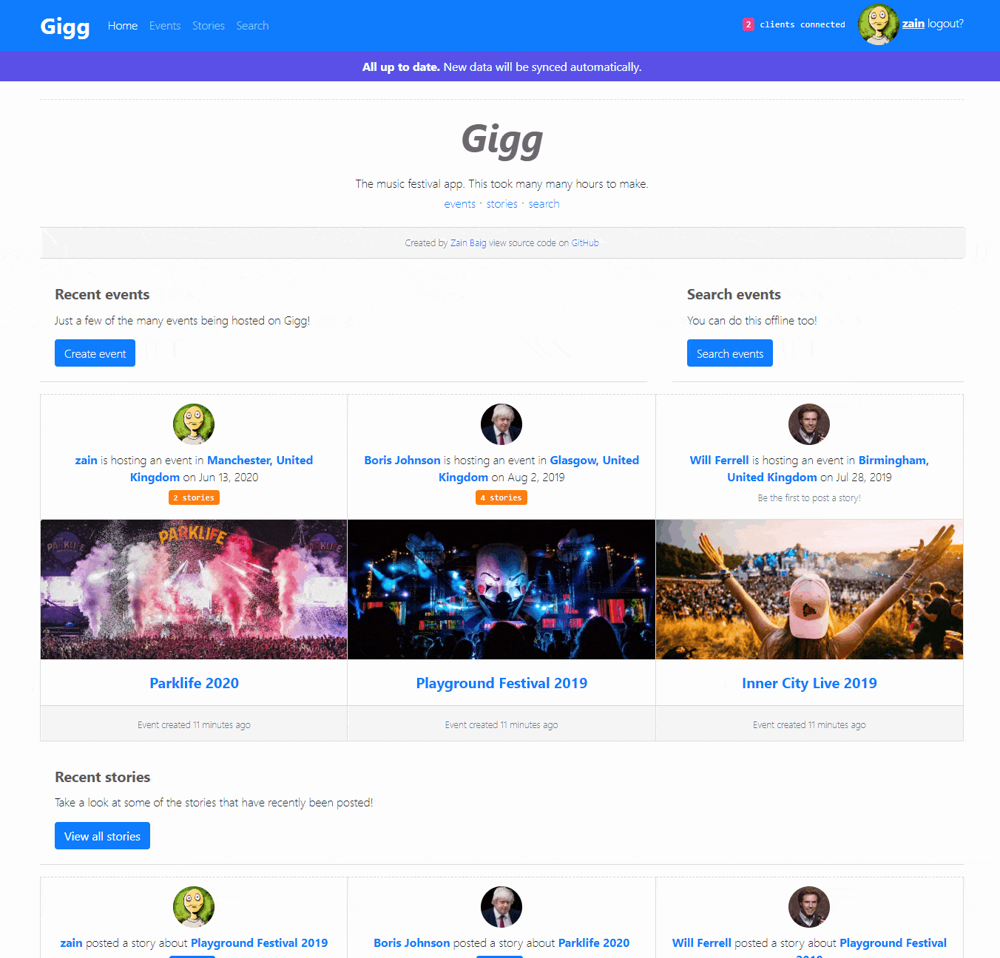

#### Offline


# Features/Achievements
- Decoupled client/server architecture with no dependencies between them.
- Batch/shell scripts provided to automatically install, build and run the app in 2 clicks.

### Server-side
- [Stateless express server RESTful API](server/api) (no sessions) whilst also supporting **secure user authentication and authorization** using JSON Web Tokens (JWT) to encrypt user information. See 
  - [passport strategy](server/config/passport.js)
  - [user model hooks and methods to generate token](server/api/users/users.model.js)
  - [user controller](server/api/users/users.controller.js)
  
  ```Javascript
   /**
     * usersController.login()
     */
    login: function(req, res) {
        User.findOne({email: req.body.email}, function (err, user) {
            if (err) throw err;

            if (!user) {
                return res.status(401).json({
                    success: false,
                    message: 'Authentication failed. User not found.'
                });
            }
            
            // check if password matches
            user.comparePassword(req.body.password, function (err, isMatch) {
                if (isMatch && !err) {
                
                    // if user is found and password is right create a token
                    var token = user.generateJSONWebToken();

                    // return the information including token as JSON
                    return res.status(200).json({
                        success: true,
                        user: {
                            username: user.username,
                            email   : user.email,
                            photo   : user.photo,
                            token: 'JWT ' + token
                        }
                    });
                }

                return res.status(401).json({
                    success: false,
                    message: 'Authentication failed. Wrong password.'
                });
            });

        });
    }
  ```
  
- The RESTful API has a model, route, controller design.

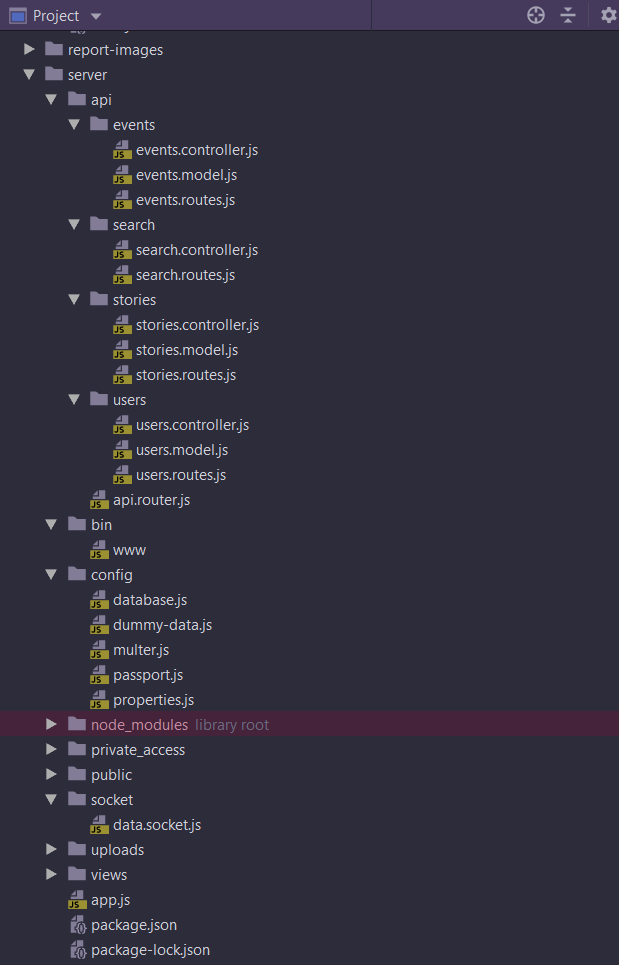

- **Mongo database** with a relational design between models via Mongoose. Text fields are indexed for efficient search. See:
  - [user model](server/api/users/users.model.js)
  - [event model](server/api/events/events.model.js)
  - [story model](server/api/stories/stories.model.js)
  
- User registration and log in

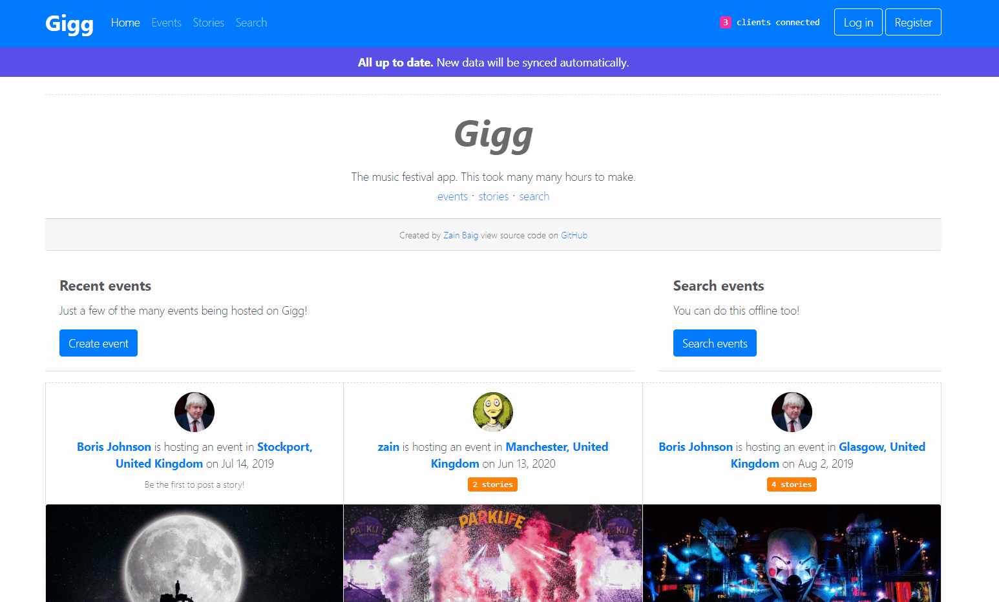

- **User passwords are hashed and salted** before entering the database or being compared for authentication using Mongo lifecycle hooks.

```Javascript
/**
 * Mongoose middleware to automatically hash the password before it's
 * saved to the database.
 *
 */
User.pre('save', function (next) {
    var user = this;

    // only hash the password if it has been modified (or is new)
    if (!user.isModified('password')) return next();

    // generate salt
    bcrypt.genSalt(SALT_WORK_FACTOR, function (err, salt) {
        if (err) return next(err);

        // hash the password using new salt
        bcrypt.hash(user.password, salt, function (err, hash) {
            if (err) return next(err);

            // override the cleartext password with the hashed one
            user.password = hash;
            next();
        });
    });
});
```

- Create events with title, description, photo, location by address, city, co-ordinates, date and creator. Requires authorisation.


- Create stories for events with TLDR (too long didn't read), description, multiple photos and creator. Requires authorisation.

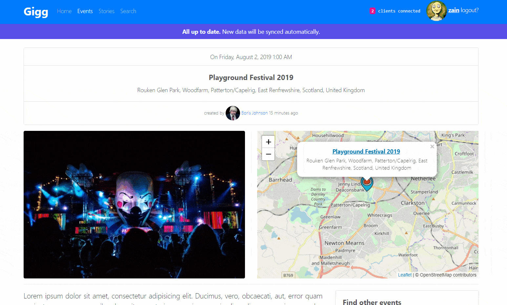

- Search via API (the client will use an API search for text fields if online, otherwise it will use its own offline search). 
  - [search api](server/api/search/search.controller.js)

- Automatically handle relations operations, e.g. if a story is created, since events have many stories the corresponding events stories array should be updated to include it, same goes for the user model etc. See model pre-save hooks. Example, creating an event:

 ```Javascript
 // Mongoose middleware to update the User object associated with this Event.
 Event.pre('save', function (next) {
     // Don't do anything unless this is a new Story being created
     if (!this.isNew) {
         return next();
     }

     // Find the user that created the event and update their events array
     User.updateOne({_id: this.creator}, {
         $push: {events: this._id}
     }).then(function () {
         next();
     }).then(null, function (err) {
         next(err);
     });
 });

 ```

- When running the server the database is wiped, dummy data is added to the database automatically just before running it. See:
  - [mongo dummy data seed](server/config/dummy-data.js)

- Server side socket.io implementation. Upon client connection, the server socket emits a message `complete-data` containing all events and stories in JSON format. An express middleware function adds the socket.io object to every response, allowing controllers to access the socket and emit events. 

  When a new event/story is created the controllers access the server socket through the response object and emit messages `new-event` or `new story` containing the data that has been created. See:
  - [server socket](server/socket/data.socket.js)
  - [express middleware to add socket.io to response object](server/app.js)
  - [emitting new events](server/api/events/events.controller.js) (see func::create)
  - [emitting new stories](server/api/stories/stories.controller.js) (see func::create)
  
- HTTPS secured.

To save time I skipped some features with very similar or trivial logic, e.g. deleting events/stories, adding comments, updating already posted things.
 
### Client-side
- **Angular 8 client** with the design split up into feature modules, shared modules, reusable components, services and helpers.

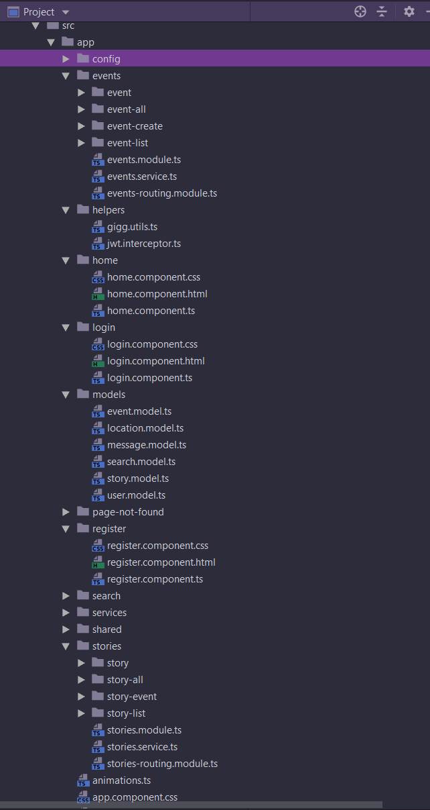

- Supports offline mode, client stays up to date and synced with the server. See below for how it's achieved.

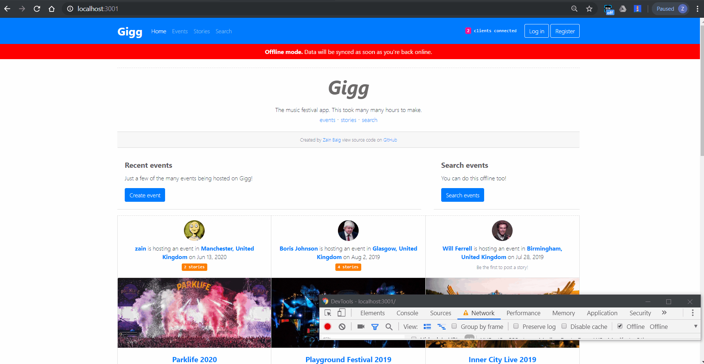

- Custom (not generated by Angular) **service worker** which uses a *network then latest cache strategy*. Newly fetched resources are cached automatically. User always has latest resources at point of going offline. See:
  - [gigg service worker](client/src/gigg-service-worker.js)
  
- User connectivity status managed by a service. **BehaviourSubjects** are used to push new data to subscribed components. Components subscribe to the the **Observable** derived from the Subject and are continously notified of any changes. See:
  - [connectivity service](client/src/app/services/connectivity.service.ts)

```Javascript
import { Injectable } from '@angular/core';
import {BehaviorSubject, Observable} from "rxjs";

@Injectable({
  providedIn: 'root'
})
export class ConnectivityService {

  connectivitySubject$: BehaviorSubject<Boolean> = new BehaviorSubject<Boolean>(true);

  constructor() { }

  connected(): Observable<Boolean> {
    return this.connectivitySubject$.asObservable();
  }

  init() {
    window.addEventListener('online',  (event) => {
      console.log(this.serviceName + "Updating connectivity status: online");
      this.connectivitySubject$.next(true);
    });

    window.addEventListener('offline', (event) => {
      console.log(this.serviceName + "Updating connectivity status: offline");
      this.connectivitySubject$.next(false);
    });
  }
}
```

- Client side **Socket.io implementation** to continuously stay in sync with the server via a service. See:
  - [socket service](client/src/app/services/socket.service.ts).

- Data is stored locally in **IndexedDB** and all GET requests use local data via a service.
  - [data service](client/src/app/services/data.service.ts).

- The connectivity service, socket service and data service work together to achieve seamless data syncing and a reactive UI.

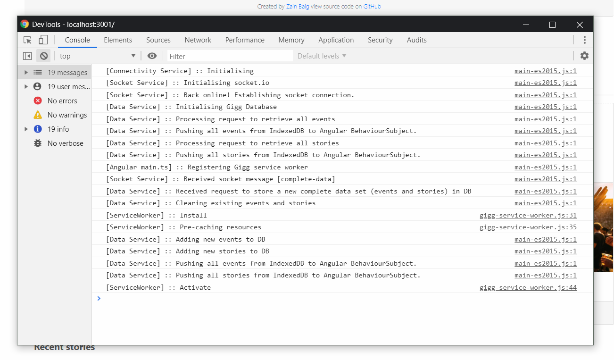

- The app is completely **functional offline** other than POST requests.

- When user goes offline, all POST forms are disabled. This is achieved by the component subscribing to the connectivity status through the connectivity service and using **async pipes** in the template to automatically update the UI whenever a change is sent.

```html
<form #storyCreateForm="ngForm" (ngSubmit)="onSubmit()">
    <fieldset [disabled]="!(connected$ | async) || !(user$ | async)">
        
        <!--- form code omitted for brevity --->
        
        <button type="submit" [disabled]="loading" class="btn btn-primary">
            <span *ngIf="loading" class="spinner-border spinner-border-sm mr-1"></span>
            Add story
        </button>
    </fieldset>
</form>
```

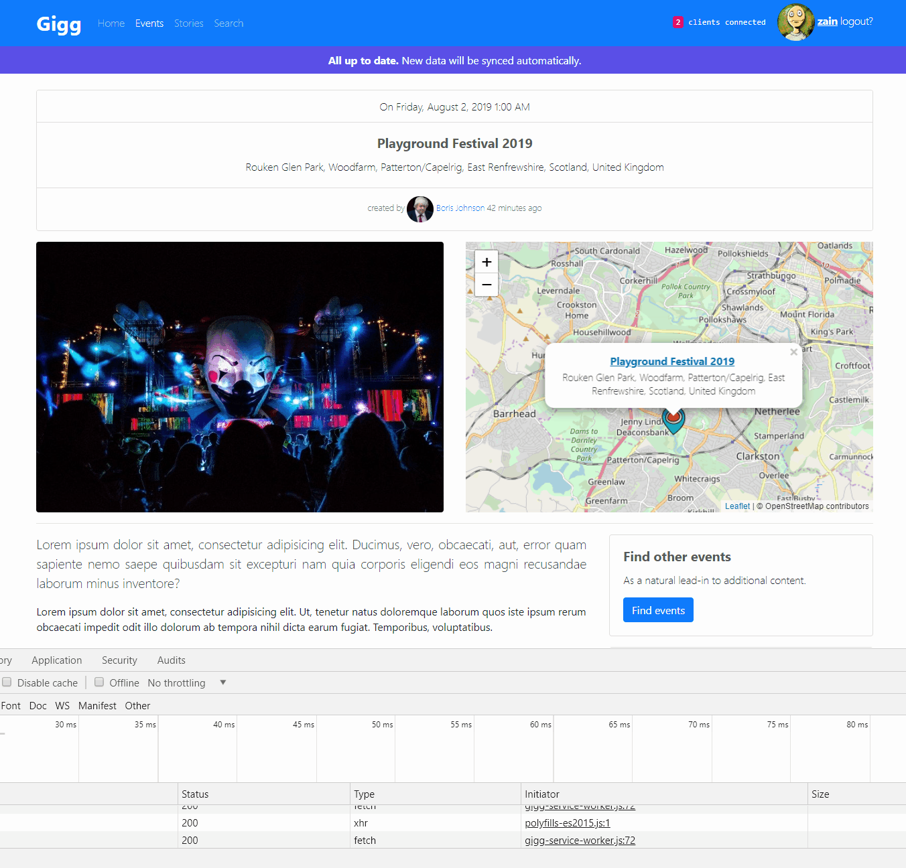

- At the point of going offline the **user always has the most up to date data.**

- As soon as user is back online, data is synced with the server.

- Any changes on the server, e.g. new event posted, new story posted automatically show up on client UI without any page refresh.

- Client UI always informs user of application status e.g. offline, online, up to date, syncing, how many clients are connected etc.

- The app can be manually F5 refreshed or closed and reopened whilst offline remaining fully functional (awkward to achieve with Angular as all components have data wiped).

- The app is a **Single Page App (SPA)** in its entirety with everything updating without any page refresh. This is achieved by making components subscribe to RxJS (reactive javascript) **Observables** and **BehaviourSubjects**.

- **LeafletJS** for location selection, viewing already selected locations e.g. for events and searching.

- Search events by map bounds or **search this area**. Results are added as markers with pop-ups to the map and also show up on the UI after being fed to the event-list component. Also works **offline**.

  When the search by area button is pressed, the events service retrieves all events from the data service (locally) and checks if their latitude and longitude are within the bounds of the map. All events that satisfy this are added to the map and the search component's event list is updated (triggering a UI update). See:
  - [events service](client/src/app/events/events.service.ts)
  - [search page component](client/src/app/search/search-page/search-page.component.ts)
  
```Javascript
  searchThisArea() {
    let foundEvents = [];

    this.eventsService.getEvents()
      .subscribe(
        (events: Event[]) => {
          events.forEach(event => {
            let coords = latLng([event.location.y, event.location.x]);
            if(this.map.getBounds().contains(coords)) {
              foundEvents.push(event);
            }
          });

          this.events = foundEvents;
          this.addMarkersToMap(foundEvents);
          this.messagesService.sendMessage({success: true, text: 'Area search succeeded!'});
        },
        error => {
          this.messagesService.sendMessage({success: false, text: error.error.message});
        });
  }
```

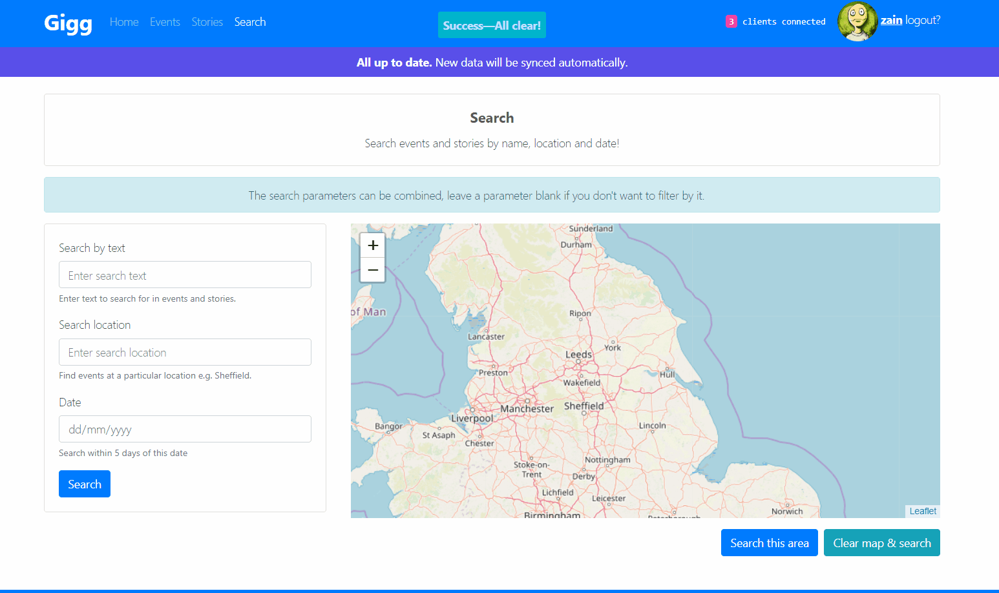

- Upon successful authentication with server, an **encrypted authorisation token** is stored locally. If the token is stored, all HTTP requests through Angular are intercepted and the token is appended to request headers via a custom http interceptor allowing the user to access secure API endpoints such as creating events and stories. See:
  - [jwt interceptor](client/src/app/helpers/jwt.interceptor.ts)
  
  ```Javascript
  import { Injectable } from '@angular/core';
  import { HttpRequest, HttpHandler, HttpEvent, HttpInterceptor } from '@angular/common/http';
  import { Observable } from 'rxjs';

  import { AuthenticationService } from '../services/authentication.service';

  @Injectable()
  export class JwtInterceptor implements HttpInterceptor {
    constructor(private authenticationService: AuthenticationService) {}

    intercept(request: HttpRequest<any>, next: HttpHandler): Observable<HttpEvent<any>> {

      // If there is an active user with a JSON Web Token, automatically add it to headers
      let activeUser = this.authenticationService.getUserData();

      if (activeUser && activeUser.token) {
        request = request.clone({
          setHeaders: {
            Authorization: activeUser.token
          }
        });
      }

      return next.handle(request);
    }
  }
  ```
  
- The app is a **PWA - fast, reliable, installable and optimised**

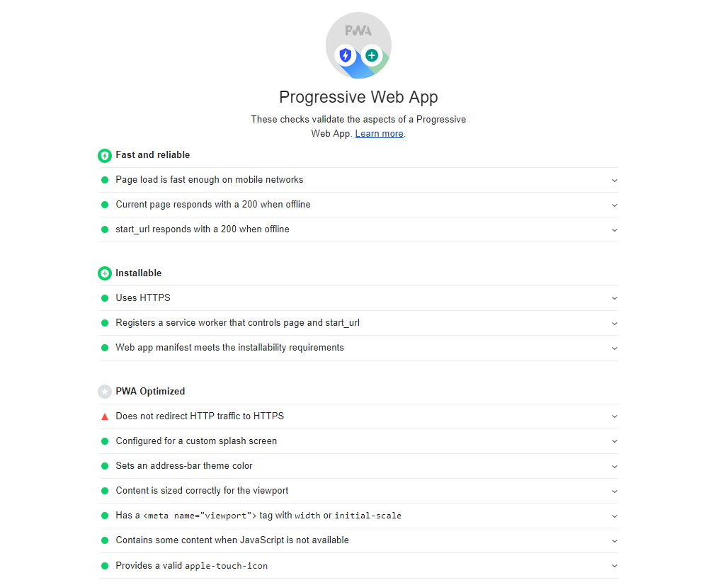

- **Fully responsive** design using Bootstrap 4.

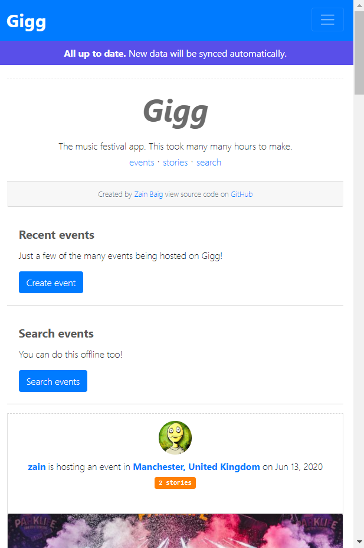

# Install & Run

The client and server both need their dependencies installed with npm. This can be done by manually navigating into their respective directories and executing commands or by running the batch/shell scripts provided in the root directory (see below).

## Install

First execute the installation script to install both the client and the server.

### Windows
```console
> install.bat
```
### Mac/Linux
```console
$ install.sh
```
To install manually, just navigate into the client and server directories and run `$ npm install` to install the dependencies.

## Run
Next, execute the script to automatically build the Angular client for production and start the server.

### Windows

```console
> build-client-run-server.bat
```

### Mac/Linux

```console
$ build-client-run-server.bat
```

To run the app manually first build the client by navigating into the client directory and executing the command below. 

```console
$ ng build --prod --output-hashing none
```
The `--prod` command enables the **service worker** and gets everything ready for production. The `--output-hashing none` command configures Angular to generate distribution files with fixed file names so that they can be cached by our service worker.

Next, start the server manually by executing the command below in the server directory.

```console
$ npm start
```

### Opening the App

In a browser of your choice navigate to the URL below to open the app.

```console
http://localhost:3001
```

**Note**: I've disabled HTTPS whilst working on localhost due to issues with auditing with applications such as Google Lighthouse when evaluating the app.
