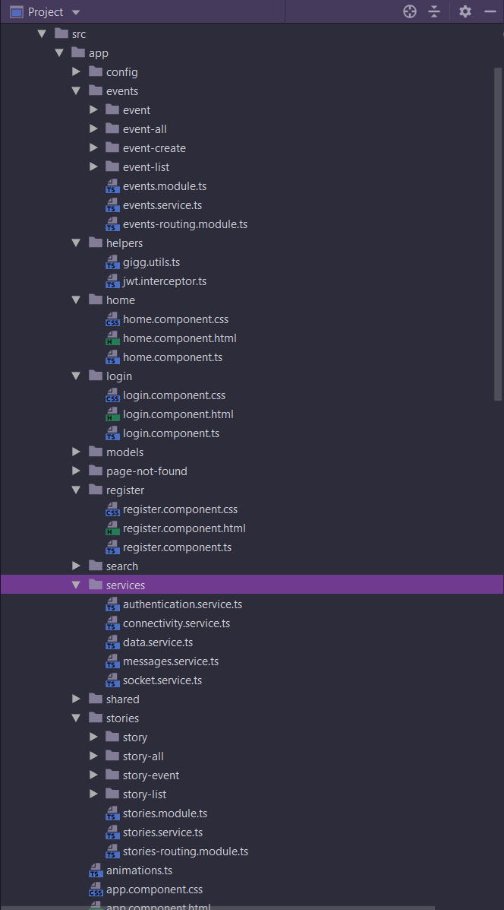
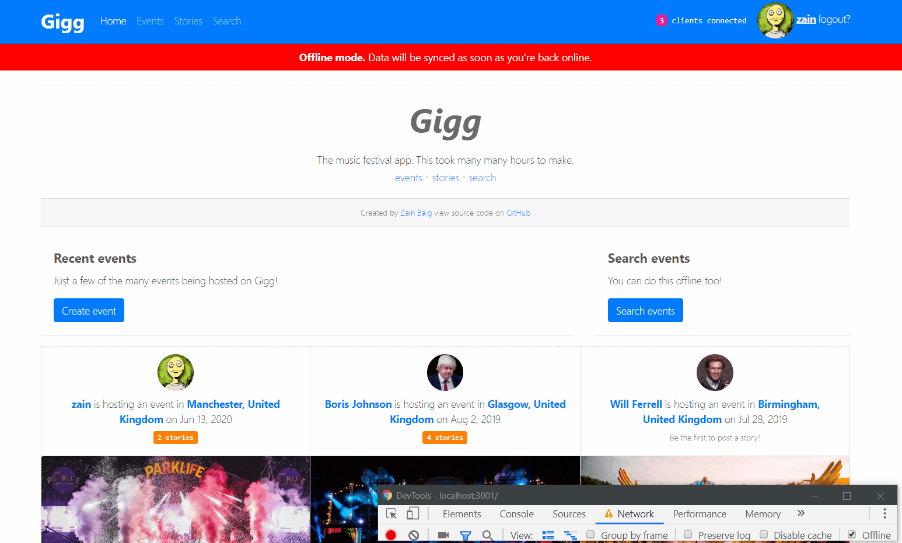

The application is an installable [Progressive Web App](https://developers.google.com/web/progressive-web-apps/) built with MongoDB, Angular 8, ExpressJS and NodeJS. 

- Stateless server API
- Fully functional offline (including offline full-text search, search by map, can also be closed and opened).
- Client and server automatically synced
- Single page client
- Service worker caching
- Installable
- PWA
- Efficient in terms of compute resources
- Easily scalable
- High performance
- Non-blocking
- Capable of handling many thousands of concurrent requests

The only third party libraries used are: 
- passport (express middleware for user authentication)
- multer (for handling multipart/form-data)
- bootstrap 4 (responsive web design)
- dexie (TypeScript wrapper for IndexedDB)
- socket.io (Web sockets)

Want to skip the documentation and go straight to [installing & running the app](#install--run)?

**Note**: Due to time-contraints there are some areas of the app that are not as optimal as they could be. I also skipped some features with trivial logic or very similar logic to other features already implemented (e.g. updating already posted things, deleting posts, pagination etc). This is to give more time to work on a wider range of the objectives of the assignment.

---
### Gigg in action


---
#### Offline


# Features/Achievements
- Decoupled client/server architecture with no dependencies between them.
- Batch/shell scripts provided to automatically install, build and run the app in 2 clicks.

### Server-side
- [stateless/asynchronous express application server & RESTful API](server/api) (no sessions) whilst also supporting **secure user authentication and authorization** using JSON Web Tokens (JWT) that encrypt user information with a secret key stored on the server. 
  
  Since the server is **single-threaded**, **completely stateless** and **asynchronous** with **no blocking operations**, it is already capable of handling many thousands of concurrent requests. 
  
  This means that the node server doesn't wait around for IO operations such as database searches to complete like other conventional multi-threaded synchronous servers such as Apache Tomcat that follow the one thread per connection model. It is therefore much quicker. The server also wastes less resources, consider a request that does not require much processing, a conventional web server would need to spawn an entire thread (or use a pooled thread) to process it.  
  
  It also becomes really simple to scale the application even further by spawning multiple node/express application servers/processes and putting a **reverse proxy configuration** in front of them with a server such as Nginx. This enables **load balancing** to distribute client requests evenly across backend servers, better performance and enhanced security, e.g. a DDOS attack takes out the Nginx server but the app servers would still be alive and kicking.
  
  See:

  - [passport strategy](server/config/passport.js)
  - [user model hooks and methods to generate token](server/api/users/users.model.js)
  - [user controller](server/api/users/users.controller.js)
  - [encryption secret](server/config/properties.js)
---

  ```Javascript
    login: function(req, res) {
        User.findOne({email: req.body.email}, function (err, user) {
            if (err) throw err;

            if (!user) {
                return res.status(401).json({
                    success: false,
                    message: 'Authentication failed. User not found.'
                });
            }
            
            // check if password matches
            user.comparePassword(req.body.password, function (err, isMatch) {
                if (isMatch && !err) {
                
                    // if user is found and password is right create a token
                    var token = user.generateJSONWebToken();

                    // return the information including token as JSON
                    return res.status(200).json({
                        success: true,
                        user: {
                            username: user.username,
                            email   : user.email,
                            photo   : user.photo,
                            token: 'JWT ' + token
                        }
                    });
                }

                return res.status(401).json({
                    success: false,
                    message: 'Authentication failed. Wrong password.'
                });
            });

        });
    }
```
  
- The RESTful API has a model, route, controller design.


- **Mongo database** with a relational design between models via Mongoose. Text fields are indexed for efficient search. See:

  - [user model](server/api/users/users.model.js)
  - [event model](server/api/events/events.model.js)
  - [story model](server/api/stories/stories.model.js)
  
- User registration and log in


- **User passwords are hashed and salted** before entering the database or being compared for authentication using Mongo lifecycle hooks.

```Javascript
/**
 * Mongoose middleware to automatically hash the password before it's
 * saved to the database.
 *
 */
User.pre('save', function (next) {
    var user = this;

    // only hash the password if it has been modified (or is new)
    if (!user.isModified('password')) return next();

    // generate salt
    bcrypt.genSalt(SALT_WORK_FACTOR, function (err, salt) {
        if (err) return next(err);

        // hash the password using new salt
        bcrypt.hash(user.password, salt, function (err, hash) {
            if (err) return next(err);

            // override the cleartext password with the hashed one
            user.password = hash;
            next();
        });
    });
});
```

- Create events with title, description, photo, location by address, city, co-ordinates, date and creator. Requires authorisation.


- Create stories for events with TLDR (too long didn't read), description, multiple photos and creator. Requires authorisation.


---
- Search via API (the client will use an API search for text fields if online, otherwise it will use its own offline search client-side). See

  - [search api](server/api/search/search.controller.js)

- Automatically handle relations operations, e.g. if a story is created, since events have many stories the corresponding events stories array should be updated to include it, same goes for the user model etc. See model pre-save hooks. Example, creating an event:

 ```Javascript
 // Mongoose middleware to update the User object associated with this Event.
 Event.pre('save', function (next) {
     // Don't do anything unless this is a new Story being created
     if (!this.isNew) {
         return next();
     }

     // Find the user that created the event and update their events array
     User.updateOne({_id: this.creator}, {
         $push: {events: this._id}
     }).then(function () {
         next();
     }).then(null, function (err) {
         next(err);
     });
 });

 ```
- When retrieving data from MongoDB object references are resolved/populated before sending to client. 

  For example, when retrieving a particular event, the ID of the user that created the event and an array of story id's belonging to the event are also returned. However we want to send the actual user object and story objects themselves, not just ID'S. See:
  
  - [events controller](server/api/events/events.controller.js) func::show()

```Javascript
  show: function (req, res) {
    var id = req.params.id;

    /**
     * The event model will return 'creator' as the ID of the user as JSON in the response. However,
     * We want it to return the user as an object so we can access username etc. The 'populate'
     * function will resolve the user based on the creator id and add it to the JSON response.
     *
     * Don't send back password!
     */
    eventsModel.findOne({_id: id})
      .populate('creator', '-password')
      .populate({path: 'stories', populate: {path: 'creator', select: '_id username photo'}})
      .exec(function (err, event) {
        if (err) {
          return res.status(500).json({
            message: 'Error getting event.'
          });
        }
        if (!event) {
          return res.status(404).json({
            message: 'No such event'
          });
        }
        return res.json(event);
      });
  }
```

- When running the server the database is wiped, dummy data is added to the database automatically just before running it. See:

  - [mongo dummy data seed](server/config/dummy-data.js)

- Server side **socket.io** implementation. Upon client connection, the server socket emits a message `complete-data` containing all events and stories in JSON format. This is convenient as whenever a user goes offline and reconnects, they are sent the most up to date data. An express middleware function also adds the socket.io object to every response, allowing controllers to access the socket and emit events.

  When a new event/story is created the controllers access the server socket through the response object and emit messages `new-event` or `new-story` containing the data that has been created. See:
  
  - [server socket](server/socket/data.socket.js)
  - [express middleware to add socket.io to response object](server/app.js)
  - [emitting new events](server/api/events/events.controller.js) (see func::create)
  - [emitting new stories](server/api/stories/stories.controller.js) (see func::create)
  
  
```Javascript
io.on('connection', function (socket) {
  io.emit('connections', ++connections);

  getEvents.then(events => {
    getStories.then(stories => {
      let data = {events: events, stories: stories};
      socket.emit('complete-data', data);
    })
  });

  socket.on('disconnect', function () {
    io.emit('connections', --connections);
  });
});
```

- HTTPS secured.

To save time I skipped some features with very similar or trivial logic, e.g. deleting events/stories, adding comments, updating already posted things.
 
### Client-side
- **Angular 8 client** written in **TypeScript** with the design split up into feature modules, shared modules, reusable components, services and helpers.



- Since we're using TypeScript, we always explicitly declare the type of data we expect to receive in the form of TypeScript **model classes**. This allows for the **automatic deserialisation** of recieved JSON data without any extra code. This proves very handy and reduces bugs and code complexity throughout. See:

  - [typescript user model](client/src/app/models/user.model.ts)
  - [typescript event model](client/src/app/models/event.model.ts)
  - [typescript story model](client/src/app/models/story.model.ts)
  - [typescript location model](client/src/app/models/location.model.ts)
  - [typescript message model](client/src/app/models/message.model.ts)
  - [typescript search model](client/src/app/models/search.model.ts)

- Supports **offline mode**, client stays up to date and **synced with the server**. See below for how it's achieved. (The sync process happens much quicker than shown in the gif, the animation was extended just to show it occuring.)



- Custom (not generated by Angular) **service worker** which uses a *network then latest cache strategy*. Newly fetched resources are cached automatically. User always has latest resources at point of going offline. 

  The service worker is bootstrapped to run in the browser along with the application's root module (AppModule) in Angular's `main.ts` file. It only runs in production mode. 
  
  **Note**: Angular's default build command `ng build` generates files for distribution with unique names, this is no good for us as we want to pre-cache certain files by names we expect not to change. To force angular to generate files with static names we can use the `ng build --output-hashing none` command. We also need to provide the `--prod` option to enable the servce worker. See:

  - [angular main.ts](client/src/main.ts)
  - [gigg service worker](client/src/gigg-service-worker.js)
  - [installing & running the app](#install--run)
  
 ```Javascript
import { enableProdMode } from '@angular/core';
import { platformBrowserDynamic } from '@angular/platform-browser-dynamic';

import { AppModule } from './app/app.module';
import { environment } from './environments/environment';

if (environment.production) {
  enableProdMode();
}

platformBrowserDynamic().bootstrapModule(AppModule).then(() => {
  if ('serviceWorker' in navigator && environment.production) {
    navigator.serviceWorker.register('./gigg-service-worker.js');
  }
}).catch(err => console.log('[Angular main.ts] ::' + err));
```
  
- User connectivity status managed by a **connectivity service**. **BehaviourSubjects** are used to push new data to subscribed components. Components subscribe to the the **Observable** derived from the Subject and are continously notified of any changes. See:

  - [connectivity service](client/src/app/services/connectivity.service.ts)

```Javascript
import { Injectable } from '@angular/core';
import {BehaviorSubject, Observable} from "rxjs";

@Injectable({
  providedIn: 'root'
})
export class ConnectivityService {

  connectivitySubject$: BehaviorSubject<Boolean> = new BehaviorSubject<Boolean>(true);

  constructor() { }

  connected(): Observable<Boolean> {
    return this.connectivitySubject$.asObservable();
  }

  init() {
    window.addEventListener('online',  (event) => {
      this.connectivitySubject$.next(true);
    });

    window.addEventListener('offline', (event) => {
      this.connectivitySubject$.next(false);
    });
  }
}
```

- Client side **Socket.io implementation** to continuously stay in sync with the server via a **socket service**. The socket listens for the `complete-data` message, the `new-event` message and the `new-story` message. The received data is sent to the data service for processing. In the callback, upon receiving data, we define the types we expect to recieve. This enables TypeScript to **automatically deserialise** the recieved data into our pre-defined models.
  
  The socket service subscribes to the connectivity service's `connection$` observable in order to disconnect itself whenever the client goes offline. It reconnects itself when the client comes back online. This is required due to a quirk in how offline mode works in some browsers (they do not seem to disconnect sockets), which makes it difficult to test otherwise.
  
  Whenever a message is receieved the `sync$` behaviour subject is updated to tell subscribed components that we are currently syncing, once the data service is done processing the recieved data, we set the sync status to false again. The `connections` event is also listened for (total number of clients currently connected to server) which is pushed to a `connections$` behaviour subject. Any subscribed components will recieve the number of clients connected in real-time.
  
  See:

  - [socket service](client/src/app/services/socket.service.ts).
  
```Javascript
export class SocketService {

  private syncing$: BehaviorSubject<Boolean> = new BehaviorSubject<Boolean>(false);
  private connections$: BehaviorSubject<Number> = new BehaviorSubject<Number>(0);

  socket;

  constructor(private dataService: DataService,
              private connectivityService: ConnectivityService) {}

  init() {
    this.socket = io(Properties.SOCKET_IO_URL);

    this.socket.on('complete-data', async (data: {events: Event[], stories: Story[]}) => {
      this.syncing$.next(true);
      await this.dataService.processCompleteData(data);
      this.syncing$.next(false);
    });

    this.socket.on('new-event', async (data: Event) => {
      this.syncing$.next(true);
      await this.dataService.processNewEvent(data);
      this.syncing$.next(false);
    });

    this.socket.on('new-story', async (data: Story) => {
      this.syncing$.next(true);
      await this.dataService.processNewStory(data);
      this.syncing$.next(false);
    });

    this.socket.on('connections', connections => {
      this.connections$.next(connections);
    });

    this.connectivityService.connected().subscribe(online => {
      if (online) {
        this.socket.connect();
      } else {
        this.socket.disconnect();
      }
    });
  }

  getSyncStatus(): Observable<Boolean> {
    return this.syncing$.asObservable();
  }

  getConnections(): Observable<Number> {
    return this.connections$.asObservable();
  }
}
```

- Data is always stored locally and all GET requests use local data via the **data service**. The data service relies on being sent data from the **socket service** and interfaces with a local asynchronous NoSQL database store **IndexedDB** that ships with all major browsers. The service uses [Dexie](https://dexie.org/docs/Typescript) which is a TypeScript wrapper for IndexedDB.

  The cool thing about it is that it allows for **directly storing typescript classes** without any extra code and figures out primary-keys and relations itself. Since the socket service sends us data that is already deserialised into our expected typescript model classes. It is simply a matter of adding them to the database as class objects.
  
  The data service owns two behaviour subjects `events$` and `stories$`. Every time we update the local database with new objects from the socket service, we push the updated data into the behaviour subjects. Observables are derived from the two behaviour subjects which other components and services such as the **events service**, **stories service** and **search service** subscribe to. For example, the events service calls the `getEvents()` method in the data service and subscribes to the returned Observable. This enables the UI to automatically update seamlessly.
  
  The resulting code to store data, retrieve data and refresh the UI from becomes simple, short and intuitive. **Note**: the below code can definitely be optimised (not done due to time constraints) e.g. instead of clearing the whole db, check what needs to be updated and update those only. Also instead of querying and pushing the whole array to the behaviour subjects, only push those that have actually changed.
  
  **Edit**: The code for storing multiple objects (e.g. when adding all stories/events received) to indexeddb needs to be updated so that it occurs in a single transaction. Currently (unintended) a transaction will be opened for every single object added. Simply wrap the code in `db.transaction('rw', func)` 
  
  See:

  - [data service](client/src/app/services/data.service.ts)
  - [typescript event model](client/src/app/models/event.model.ts)
  - [typescript story model](client/src/app/models/story.model.ts)
  
```Javascript

class GiggDatabase extends Dexie {
  events: Dexie.Table<Event,number>;

  constructor() {
    super("GiggDatabase");
    this.version(1).stores({
      events: "_id,title,date,location.address,location.x,location.y,photo,createdAt,creator,stories,*searchIndex",
      stories: "_id,tldr,text,createdAt,photos,event,creator"
    });
  }
}

export class DataService {

  private events$: BehaviorSubject<Event[]> = new BehaviorSubject<Event[]>([]);
  private stories$: BehaviorSubject<Story[]> = new BehaviorSubject<Story[]>([]);

  db;

  constructor() { }

  init() {
    this.db = new GiggDatabase();
  }

  getEvent(id: string) {
    return this.db.events.where('_id').equals(id).first();
  }

  getEvents(): Observable<Event[]> {
    return this.events$.asObservable();
  }

  getStory(id: string) {
    return this.db.stories.where('_id').equals(id).first();
  }

  getStories(): Observable<Story[]> {
    return this.stories$.asObservable();
  }

  async processCompleteData(data: {events: Event[], stories: Story[]}) {
    await this.db.events.clear();
    await this.db.stories.clear();

    await data.events.forEach(event => {
      this.db.events.add(event);
    });

    await data.stories.forEach(story => {
      this.db.stories.add(story);
    });

    this.updateEvents();
    this.updateStories();
  }

  async processNewEvent(event: Event) {
    await this.db.events.add(event);
    this.updateEvents();
  }

  async processNewStory(story: Story) {
    await this.db.stories.put(story);

    await this.db.events
      .where('_id')
      .equals(story.event._id)
      .modify(event => event.stories.push(story));

    this.updateEvents();
    this.updateStories();
  }

  async updateEvents() {
    const events = await this.db.events.toArray();
    this.events$.next(events);
  }

  async updateStories() {
    const stories = await this.db.stories.toArray();
    this.stories$.next(stories);
  }
  
  ...offline search code omitted...
```


- The connectivity service, socket service and data service work together to achieve seamless data syncing and a reactive UI.


- An **authentication service** manages all client side aspects of user state (authenticated, logged out etc). Upon successful authentication, the server sends back a `User` object that contains an encrypted token indentifying the user. The object is stored in local storage to keep the user logged in and is pushed to a `user$` behaviour subject that other components can subscribe to. 

  If the user is logged in, all requests should include the token in the `Authorization` HTTP header. See:

  - [authentication service](client/src/app/services/authentication.service.ts)

```Javascript
export class AuthenticationService {

  private user$: BehaviorSubject<User>;

  constructor(private http: HttpClient,
              private router: Router,
              private messagesService: MessagesService) {
    this.user$ = new BehaviorSubject<User>(JSON.parse(localStorage.getItem('user')));
  }

  getUser() : Observable<User> {
    return this.user$.asObservable();
  }

  getUserData() : User {
    return this.user$.value;
  }
  
  ...code omitted...

  login(email: string, password: string) {
    return this.http.post<any>('/api/users/login', { email, password })
      .pipe(map(data => {
        // login successful if there's a jwt token in the response
        if (data.user && data.user.token) {
 
          // store user details and jwt token in local storage to keep user logged in between page refreshes
          localStorage.setItem('user', JSON.stringify(data.user));
          this.user$.next(data.user);
        }

        return data;
      }));
  }
  
  ...code omitted...
}
```


- If the `User` object is stored locally along with the **encrypted authorisation token**, all HTTP requests through Angular are intercepted and the token is appended to request headers via a custom http interceptor allowing the user to access secure API endpoints such as creating events and stories. See:

  - [jwt interceptor](client/src/app/helpers/jwt.interceptor.ts)
  
---

  ```Javascript
  import { Injectable } from '@angular/core';
  import { HttpRequest, HttpHandler, HttpEvent, HttpInterceptor } from '@angular/common/http';
  import { Observable } from 'rxjs';

  import { AuthenticationService } from '../services/authentication.service';

  @Injectable()
  export class JwtInterceptor implements HttpInterceptor {
    constructor(private authenticationService: AuthenticationService) {}

    intercept(request: HttpRequest<any>, next: HttpHandler): Observable<HttpEvent<any>> {

      // If there is an active user with a JSON Web Token, automatically add it to headers
      let activeUser = this.authenticationService.getUserData();

      if (activeUser && activeUser.token) {
        request = request.clone({
          setHeaders: {
            Authorization: activeUser.token
          }
        });
      }

      return next.handle(request);
    }
  }
  ```
  
- A **messages service** is used by most components and some services to push information about the outcome of user actions to the client. For example, informing the user that they entered the wrong details to login. 

  The service owns a `messages$` behaviour subject and exposes the derived **observable** which the root `app.component.ts` subscribes to. See snippets below for usage. See:
  
  - [messages service](client/src/app/services/messages.service.ts)
  - [app component](client/src/app/app.component.ts)
  
```Javascript
...code omitted throughout snippet...

import {MessagesService} from "../services/messages.service";

@Component({
  selector: 'app-login',
  templateUrl: './login.component.html',
})
export class LoginComponent implements OnInit {

  user = new User();
  
  constructor(private authenticationService: AuthenticationService,
              private messagesService: MessagesService) {}

  onSubmit() {
    this.authenticationService.login(this.user.email, this.user.password)
      .pipe(first())
      .subscribe(
        data => {
          this.messagesService.sendMessage({success: true, text: "Hello again, " + data.user.username + "!"});
          this.router.navigate(['/']);
        },
        error => {
          this.messagesService.sendMessage({success: false, text: error.error.message});
        });
  }
}
```

```HTML
  <div *ngIf="(messages$ | async).show" class="messages" [ngClass]="(messages$ | async).success ? 'success' : 'error'" [@fadeInOut]>
    <ng-container *ngIf="(messages$ | async).success then success else error"></ng-container>
    <ng-template #success>Success&mdash;{{(messages$ | async).text}}</ng-template>
    <ng-template #error>Error&mdash;{{(messages$ | async).text}}</ng-template>
  </div>
```
  

- The app is completely **functional offline** other than POST requests.

- Search events by map bounds or **search this area**. Results are added as markers with pop-ups to the map and also show up on the UI after being fed to the event-list component. Also works **offline**.

  When the search by area button is pressed, the events service retrieves all events from the data service (locally) and checks if their latitude and longitude are within the bounds of the map. All events that satisfy this are added to the map and the search component's event list is updated (triggering a UI update). See:
  
  - [events service](client/src/app/events/events.service.ts)
  - [search page component](client/src/app/search/search-page/search-page.component.ts)
  
```Javascript
  searchThisArea() {
    let foundEvents = [];

    this.eventsService.getEvents()
      .subscribe(
        (events: Event[]) => {
          events.forEach(event => {
            let coords = latLng([event.location.y, event.location.x]);
            if(this.map.getBounds().contains(coords)) {
              foundEvents.push(event);
            }
          });

          this.events = foundEvents;
          this.addMarkersToMap(foundEvents);
          this.messagesService.sendMessage({success: true, text: 'Area search succeeded!'});
        },
        error => {
          this.messagesService.sendMessage({success: false, text: error.error.message});
        });
  }
```


- **Offline full-text search** with multiple fields and date range filtering. E.g. you can search `foo` and `i like foobar` will be found. You can search by event title, location and date range all together and the best matching results will be returned. All fields are optional.

  The search function is generic with multiple fields. The event title and address are indexed together so it becomes simple to search for both criteria at once. We can then filter by date range if a date is provided. We check to see if either the title or location is provided as input to the search, if so we search the index that is shared between them. If not we get all results and filter by date if it's provided. If no search criteria is provided, we just return all results (maybe do the opposite?). See:
  
  - [data service](client/src/app/services/data.service.ts)

```Javascript
  async searchEvents(searchData: Search): Promise<Event[]> {
    let results;

    if (searchData.text || searchData.location) {
      let text = searchData.text ? searchData.text.split(' ') : [];
      let location = searchData.location ? searchData.location.split(' ') : [];
      let words = text.concat(location);
      results = this.db.events.where('searchIndex').startsWithAnyOfIgnoreCase(words);
    } else {
      results = this.db.events;
    }

    if (!searchData.date) {
      return results.toArray();
    }

    // Filter results by date if provided. If no text or location search, then filter all events by date range.
    var providedDate = new Date(searchData.date);

    let dateBottom = new Date();
    let dateTop = new Date();

    dateBottom.setDate(providedDate.getDate() - 5);
    dateTop.setDate(providedDate.getDate() + 5);

    return results.filter(function (event) {
      let eventDate = new Date(event.date);
      return eventDate >= dateBottom && eventDate <= dateTop;
    }).toArray();
  }
```

  
  
  We manually create the and update the index `searchIndex` for the event title and address using a dexie **hook** that triggers just before an object is saved to the database. We then take the search input, split it into an array of `words` and execute a query with the `db.events.where('searchIndex').startsWithAnyOfIgnoreCase(words)` operation to achieve full-text search. To manually update the index every time an event is added: 
  
  ```Javascript
    indexEventTitleAndLocation() {
    // Add hooks that will index event title and location together for full-text search:
    this.db.events.hook("creating", (primKey, event, trans) => {
      let titleLocationCity = (event.title + " " + event.location.address + " " + event.location.city).toLowerCase();
      let cleanText = this.removePunctuation(titleLocationCity);
      event.searchIndex = this.getUniqueWordsAsArray(cleanText);
    });
  }
  ```
  

- When user goes offline or is logged out, all POST forms are disabled. This is achieved by the component subscribing to the connectivity status through the connectivity service and using **async pipes** in the template to automatically update the UI whenever a change is sent.

```html
<form #storyCreateForm="ngForm" (ngSubmit)="onSubmit()">
    <fieldset [disabled]="!(connected$ | async) || !(user$ | async)">
        
        <!--- form code omitted for brevity --->
        
        <button type="submit" [disabled]="loading" class="btn btn-primary">
            <span *ngIf="loading" class="spinner-border spinner-border-sm mr-1"></span>
            Add story
        </button>
    </fieldset>
</form>
```


- At the point of going offline the **user always has the most up to date data.**

- As soon as user is back online, data is synced with the server.

- Any changes on the server, e.g. new event posted, new story posted automatically show up on client UI without any page refresh.

- Client UI always informs user of application status e.g. offline, online, up to date, syncing, how many clients are connected etc.

- The app can be manually F5 refreshed or closed and reopened whilst offline remaining fully functional (awkward to achieve with Angular as all components have data wiped).

- The app is a **Single Page App (SPA)** in its entirety with everything updating without any page refresh. This is achieved by making components subscribe to RxJS (reactive javascript) **Observables** and **BehaviourSubjects**.

- **LeafletJS** for location selection, viewing already selected locations e.g. for events and searching.
  
- The app is a **PWA - fast, reliable, installable and optimised**


- **Fully responsive** design using Bootstrap 4.


# Install & Run

The client and server both need their dependencies installed with npm. This can be done by manually navigating into their respective directories and executing commands or by running the batch/shell scripts provided in the root directory (see below).

## Install

First execute the installation script to install both the client and the server.

### Windows
```console
> install.bat
```
### Mac/Linux
```console
$ install.sh
```
To install manually, just navigate into the client and server directories and run `$ npm install` to install the dependencies.

## Run
Next, execute the script to automatically build the Angular client for production and start the server.

### Windows

```console
> build-client-run-server.bat
```

### Mac/Linux

```console
$ build-client-run-server.sh
```

To run the app manually first build the client by navigating into the client directory and executing the command below. 

```console
$ ng build --prod --output-hashing none
```
The `--prod` command enables the **service worker** and gets everything ready for production. The `--output-hashing none` command configures Angular to generate distribution files with fixed file names so that they can be cached by our service worker.

Next, start the server manually by executing the command below in the server directory.

```console
$ npm start
```

### Opening the App

In a browser of your choice navigate to the URL below to open the app.

```console
http://localhost:3001
```

**Note**: I've disabled HTTPS whilst working on localhost due to issues with auditing with applications such as Google Lighthouse when evaluating the app.
